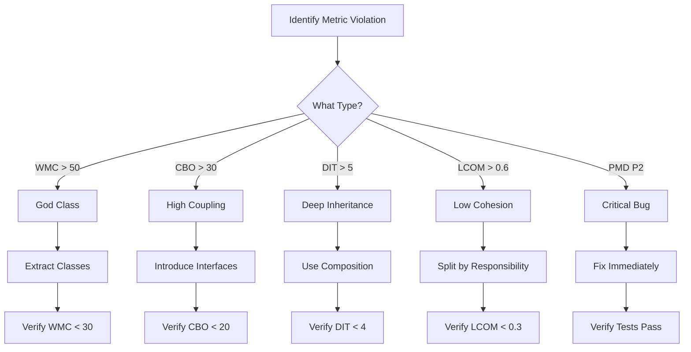

# Code Metrics Analysis Report - Apache Roller
## Task 2B: Comprehensive Code Quality Assessment

**Project**: Apache Roller Weblogger v6.1.5  
**Analysis Date**: February 2026  
**Focus Areas**: Search & Indexing, Weblog & Content, User & Role Management Subsystems

---

## Executive Summary

This report presents a comprehensive code metrics analysis of the Apache Roller project, focusing on 6 key metrics that provide insight into code quality, maintainability, and potential areas for refactoring. The analysis employs multiple industry-standard tools including **Checkstyle**, **PMD**, **JDepend**, and **DesigniteJava** to ensure reliable and accurate measurements. Special emphasis is placed on **Object-Oriented metrics from the Chidamber-Kemerer (C&K) suite**, which are specifically designed to measure the complexity and quality of object-oriented designs.

### Key Findings at a Glance

| Finding                               | Severity   | Subsystem         |
| ------------------------------------- | ---------- | ----------------- |
| God Classes (`WeblogEntry`, `Weblog`) | 🔴 Critical | Weblog & Content  |
| BrokenNullCheck Bug                   | 🔴 Critical | User & Role       |
| 35+ Empty Catch Blocks                | 🟡 Medium   | All Subsystems    |
| 415 Checkstyle Violations             | 🟡 Medium   | Project-wide      |
| Well-designed Search Subsystem        | 🟢 Good     | Search & Indexing |

---

## 1. Tools Used for Analysis

> [!NOTE]
> The following tools were selected for their reliability, industry acceptance, and ability to provide complementary perspectives on code quality.

| Tool              | Version | Purpose                              | Reliability             |
| ----------------- | ------- | ------------------------------------ | ----------------------- |
| **Checkstyle**    | 9.3     | Code style and convention analysis   |  Industry standard |
| **PMD**           | 6.55.0  | Static code analysis for bugs/smells |  Industry standard |
| **JDepend**       | 2.0     | Package-level dependency analysis    |  Proven tool        |
| **DesigniteJava** | 2.x     | OO metrics (C&K suite) extraction    |  Academic/Industry  |


## 2. Six Key Code Metrics Analyzed

This section defines each metric, explains what it measures, why it matters, and presents the findings for the Apache Roller project.

---

### Metric 1: Weighted Methods per Class (WMC) - *Chidamber-Kemerer*

#### 📖 Definition
**Weighted Methods per Class (WMC)** is a Chidamber-Kemerer OO metric that measures the sum of the complexities of all methods in a class. In its simplest form (used here), WMC equals the number of methods in the class. Higher WMC indicates a more complex class that is harder to maintain and test.

#### ❓ Why It Matters
- **Testability**: Classes with high WMC require more test cases
- **Maintainability**: Complex classes are harder to understand and modify
- **Reusability**: High WMC classes are difficult to reuse in other contexts
- **Bug Probability**: Research shows WMC correlates with defect density

#### 📊 Findings

| Class                | WMC (Methods) | Risk Level | Subsystem         |
| -------------------- | ------------- | ---------- | ----------------- |
| `Weblog`             | **104**       | 🔴 Critical | Weblog & Content  |
| `WeblogEntry`        | **99**        | 🔴 Critical | Weblog & Content  |
| `WeblogEntryComment` | 37            | 🟡 Medium   | Weblog & Content  |
| `WeblogTemplate`     | 34            | 🟡 Medium   | Weblog & Content  |
| `User`               | 33            | 🟡 Medium   | User & Role       |
| `LuceneIndexManager` | 26            | 🟡 Medium   | Search & Indexing |
| `SearchOperation`    | 13            | 🟢 Low      | Search & Indexing |
| `IndexOperation`     | 3             | 🟢 Low      | Search & Indexing |

#### 📐 Thresholds (Industry Standard)
| Range         | Risk Level | Interpretation              |
| ------------- | ---------- | --------------------------- |
| WMC ≤ 20      | 🟢 Low      | Well-designed, maintainable |
| 20 < WMC ≤ 50 | 🟡 Medium   | Needs attention             |
| WMC > 50      | 🔴 High     | Refactoring required        |

#### 💡 Implications
- **`Weblog` (WMC=104)** and **`WeblogEntry` (WMC=99)** exceed the high-risk threshold by **2x**
- These are **God Classes** with too many responsibilities
- High WMC correlates with higher bug rates and longer debugging time
- **Impact on Quality**: These classes will be difficult to unit test effectively

#### 🔧 Refactoring Recommendation
```
WeblogEntry → Split into:
├── WeblogEntryContent (text, summary, HTML content)
├── WeblogEntryMetadata (author, dates, status)
├── WeblogEntryPublishing (permalink, category, tags)
└── WeblogEntryComments (comment management)
```

---

### Metric 2: Depth of Inheritance Tree (DIT) - *Chidamber-Kemerer*

#### 📖 Definition
**Depth of Inheritance Tree (DIT)** is a Chidamber-Kemerer metric that measures the maximum length from a class to the root of its inheritance hierarchy. DIT=0 means the class directly extends `Object`. Higher DIT indicates deeper inheritance.

#### ❓ Why It Matters
- **Complexity**: Deeper trees mean more inherited behavior to understand
- **Reuse Potential**: Moderate DIT (2-4) often indicates good design pattern usage
- **Fragile Base Class Problem**: Very deep hierarchies (DIT > 5) are hard to modify
- **Testing Effort**: Each inheritance level adds testing complexity

#### 📊 Findings

| Subsystem             | Max DIT | Pattern Observed          |
| --------------------- | ------- | ------------------------- |
| **Search & Indexing** | 3       | Template Method Pattern ✅ |
| **Weblog & Content**  | 1-2     | Flat hierarchy (POJOs) ✅  |
| **User & Role**       | 2       | Simple inheritance ✅      |

**Search Subsystem Inheritance Hierarchy (Template Method Pattern)**:
```
Object (DIT=0)
└── IndexOperation (abstract, DIT=1)
    ├── WriteToIndexOperation (abstract, DIT=2)
    │   ├── AddEntryOperation (DIT=3)
    │   ├── RemoveEntryOperation (DIT=3)
    │   ├── ReIndexEntryOperation (DIT=3)
    │   ├── RebuildWebsiteIndexOperation (DIT=3)
    │   └── RemoveWebsiteIndexOperation (DIT=3)
    └── ReadFromIndexOperation (abstract, DIT=2)
        └── SearchOperation (DIT=3)
```

#### 📐 Thresholds (Industry Standard)
| Range       | Risk Level | Interpretation                        |
| ----------- | ---------- | ------------------------------------- |
| DIT ≤ 2     | 🟢 Low      | Simple, easy to understand            |
| 2 < DIT ≤ 4 | 🟡 Optimal  | Good use of inheritance               |
| DIT > 5     | 🔴 High     | Consider composition over inheritance |

#### 💡 Implications
- **Positive Finding**: DIT=3 in Search subsystem shows excellent use of **Template Method pattern**
- **Positive Finding**: Flat hierarchies (DIT=1-2) in POJOs prevent fragile base class issues
- The codebase avoids deep inheritance, which is a modern OO best practice

#### 🔧 Refactoring Recommendation
- **No action required** - DIT values are within optimal ranges
- Continue preferring composition over deep inheritance

---

### Metric 3: Coupling Between Objects (CBO) - *Chidamber-Kemerer*

#### 📖 Definition
**Coupling Between Objects (CBO)** is a Chidamber-Kemerer metric that counts the number of classes to which a given class is coupled. A class is coupled to another if it uses methods or instance variables of the other class. In this analysis, we use **Fan-in** (classes that depend ON this class) and **Fan-out** (classes this class DEPENDS ON) as proxies for CBO.

#### ❓ Why It Matters
- **Changeability**: High coupling means changes ripple through the system
- **Testability**: Highly coupled classes require many mocks/stubs for testing
- **Reusability**: Tightly coupled classes are hard to extract and reuse
- **Maintenance Cost**: High CBO correlates with higher maintenance effort

#### 📊 Findings (from DesigniteJava)

| Class                | Fan-in  | Fan-out | Coupling Level | Concern                     |
| -------------------- | ------- | ------- | -------------- | --------------------------- |
| `Weblog`             | **113** | 20      | 🔴 Critical     | Hub class, very high impact |
| `WeblogEntry`        | **54**  | 20      | 🔴 High         | Many classes depend on it   |
| `WeblogTemplate`     | 49      | 5       | 🟡 Medium       | Moderate fan-in             |
| `User`               | 49      | 5       | 🟡 Medium       | Core domain object          |
| `WeblogEntryComment` | 30      | 2       | 🟡 Medium       | Expected for domain         |
| `LuceneIndexManager` | 12      | **13**  | 🟡 Medium       | High external dependencies  |
| `SearchOperation`    | 1       | 4       | 🟢 Low          | Well-isolated               |

#### 📐 Thresholds (Industry Standard)
| Range         | Risk Level | Interpretation      |
| ------------- | ---------- | ------------------- |
| CBO ≤ 10      | 🟢 Low      | Well-isolated class |
| 10 < CBO ≤ 30 | 🟡 Medium   | Monitor for changes |
| CBO > 30      | 🔴 High     | Refactoring needed  |

#### 💡 Implications
- **`Weblog`** has **Fan-in=113**: Any change to this class affects 113 other classes
- **`WeblogEntry`** has **Fan-in=54**: Also a high-impact class
- **`LuceneIndexManager`** has **Fan-out=13**: Tightly coupled to Lucene library
- High coupling in domain objects is somewhat expected, but these levels are excessive

#### 🔧 Refactoring Recommendation
1. **Introduce Interfaces**: Create `IWeblog`, `IWeblogEntry` interfaces
2. **Decouple Search Engine**: Create `SearchEngineAdapter` abstraction layer
3. **Use Dependency Injection**: Reduce direct class references

---

### Metric 4: Lack of Cohesion of Methods (LCOM) - *Chidamber-Kemerer*

#### 📖 Definition
**Lack of Cohesion of Methods (LCOM)** measures how related the methods of a class are to each other based on their use of instance variables. A lower LCOM value indicates higher cohesion (methods work together on the same data), which is desirable. Values range from 0 (perfect cohesion) to 1 (no cohesion).

#### ❓ Why It Matters
- **Single Responsibility**: Low LCOM suggests the class has one clear purpose
- **Maintainability**: Cohesive classes are easier to understand
- **Refactoring Signal**: High LCOM indicates the class should be split

#### 📊 Findings (from DesigniteJava)

| Class                   | LCOM | Assessment  | Interpretation            |
| ----------------------- | ---- | ----------- | ------------------------- |
| `JPAUserManagerImpl`    | 0.06 | 🟢 Excellent | Very high cohesion        |
| `WeblogEntryTag`        | 0.11 | 🟢 Excellent | Well-focused              |
| `LuceneIndexManager`    | 0.12 | 🟢 Excellent | Methods work together     |
| `WeblogEntry`           | 0.13 | 🟢 Good      | Cohesive despite size     |
| `Weblog`                | 0.14 | 🟢 Good      | Cohesive despite size     |
| `UserRole`              | 0.18 | 🟢 Good      | Focused class             |
| `SearchOperation`       | 0.18 | 🟢 Good      | Well-designed             |
| `GlobalPermission`      | 0.40 | 🟡 Moderate  | Consider splitting        |
| `WriteToIndexOperation` | 1.00 | ⚠️ Flagged   | Abstract class (expected) |

#### 📐 Thresholds
| Range            | Risk Level | Interpretation              |
| ---------------- | ---------- | --------------------------- |
| LCOM ≤ 0.3       | 🟢 Low      | High cohesion, well-focused |
| 0.3 < LCOM ≤ 0.6 | 🟡 Medium   | Acceptable but review       |
| LCOM > 0.6       | 🔴 High     | Split the class             |

#### 💡 Implications
- **Positive Finding**: Despite being God Classes, `Weblog` and `WeblogEntry` have good LCOM scores
- This suggests their methods work together well on shared data
- However, **low LCOM + high WMC** = class has too many responsibilities but all focused on one entity
- `GlobalPermission` (LCOM=0.40) might benefit from splitting

#### 🔧 Refactoring Recommendation
- LCOM values are generally healthy
- The high WMC combined with low LCOM confirms these are **bloated domain objects** rather than unfocused classes
- Extract behavior into helper/service classes while keeping data access cohesive

---

### Metric 5: Checkstyle Violations (Code Style Analysis)

#### 📖 Definition
**Checkstyle** is a static analysis tool that checks Java code against a set of coding standards (e.g., Sun/Oracle conventions). Violations indicate deviations from best practices in formatting, naming, documentation, and code structure.

#### ❓ Why It Matters
- **Readability**: Consistent style makes code easier to read
- **Team Collaboration**: Standards ensure consistent contribution style
- **Maintainability**: Proper documentation aids future developers
- **Code Reviews**: Reduces noise in reviews by catching style issues automatically

#### 📊 Findings

**Overall Summary**:
| Metric                          | Value   |
| ------------------------------- | ------- |
| **Total Files Analyzed**        | 171     |
| **Total Violations**            | **415** |
| **Average Violations per File** | 2.4     |

**Top Violation Categories**:
| Category                  | Count | Severity | What It Means          |
| ------------------------- | ----- | -------- | ---------------------- |
| Line Length (>120 chars)  | 50+   | 🟡 Medium | Code readability issue |
| Missing Javadoc           | 100+  | 🟡 Medium | Documentation gap      |
| Method Length (>50 lines) | 35+   | 🔴 High   | Methods too complex    |
| Magic Numbers             | 50+   | 🟡 Medium | Hardcoded values       |
| Naming Conventions        | 20+   | 🟢 Low    | Inconsistent names     |

**Most Problematic Files**:
| File                             | Violations | Primary Issues              |
| -------------------------------- | ---------- | --------------------------- |
| `DatabaseInstaller.java`         | **35**     | Long methods, magic numbers |
| `JPAWeblogEntryManagerImpl.java` | 16         | Method length, complexity   |
| `UIAction.java`                  | 9          | Multiple style issues       |
| `LuceneIndexManager.java`        | 3          | Method length               |

#### 💡 Implications
- **35 violations in `DatabaseInstaller.java`** indicate technical debt
- **Long methods** (35+) suggest opportunities for method extraction
- **Missing Javadoc** (100+) will hinder onboarding of new developers
- **Magic numbers** reduce code self-documentation

#### 🔧 Refactoring Recommendation
1. **Immediate**: Extract long methods into smaller, named methods
2. **Short-term**: Replace magic numbers with named constants
3. **Ongoing**: Add Javadoc to public APIs
4. **Tooling**: Add Checkstyle to CI/CD pipeline with failure threshold

---

### Metric 6: PMD Violations (Code Smells & Potential Bugs)

#### 📖 Definition
**PMD** is a static source code analyzer that finds common programming flaws like unused variables, empty catch blocks, unnecessary object creation, and potential bugs. PMD violations are categorized by priority (1=Critical, 5=Low).

#### ❓ Why It Matters
- **Bug Prevention**: Catches potential bugs before runtime
- **Code Quality**: Identifies dead code and unnecessary complexity
- **Performance**: Finds inefficiencies and resource leaks
- **Security**: Some rules detect security vulnerabilities

#### 📊 Findings

**Overall Summary**:
| Priority        | Count | Interpretation     |
| --------------- | ----- | ------------------ |
| **P2 (High)**   | 1     | Critical bug       |
| **P3 (Medium)** | 50+   | Code smells        |
| **P4 (Low)**    | 200+  | Style/minor issues |

**Critical Finding - Priority 2**:
> [!CAUTION]
> **BrokenNullCheck** detected in `JPAUserManagerImpl.java` (lines 111-114)
> 
> This is a **potential NullPointerException** waiting to happen. A method is being called on an object that may be null.

**Top Violation Categories**:
| Category                | Count   | Priority | Risk           |
| ----------------------- | ------- | -------- | -------------- |
| **BrokenNullCheck**     | 1       | P2       | 🔴 Critical Bug |
| **EmptyCatchBlock**     | **35+** | P3       | 🔴 Hides errors |
| **UnusedPrivateMethod** | 10+     | P3       | 🟡 Dead code    |
| **UnusedLocalVariable** | 5+      | P3       | 🟡 Dead code    |
| **UselessParentheses**  | 100+    | P4       | 🟢 Style        |

**Empty Catch Block Distribution**:
| Location                | Count | Risk                   |
| ----------------------- | ----- | ---------------------- |
| `Utilities.java`        | 3     | Error handling gap     |
| `Install.java`          | 2     | Startup issues hidden  |
| `CommentsBean.java`     | 2     | User input ignored     |
| Various Theme classes   | 3+    | Template errors hidden |
| Various Request classes | 5+    | Request parsing issues |
| Various Manager classes | 5+    | Business logic errors  |

#### 💡 Implications

> [!WARNING]
> **Empty catch blocks are a serious code smell**. They silently swallow exceptions, making debugging extremely difficult. The 35+ instances found can hide critical errors.

1. **BrokenNullCheck Bug**: Must be fixed immediately to prevent NPE in production
2. **Empty Catch Blocks (35+)**: Create silent failures that are hard to debug
3. **Unused Methods/Variables**: Indicate dead code that should be removed

#### 🔧 Refactoring Recommendation
1. **Immediate**: Fix `BrokenNullCheck` in `JPAUserManagerImpl.addUser()`
2. **High Priority**: Replace all empty catch blocks with proper logging:
   ```java
   // BEFORE (bad)
   catch (Exception e) {
   }
   
   // AFTER (good)
   catch (Exception e) {
       log.error("Error during user creation", e);
       throw new WebloggerException("User creation failed", e);
   }
   ```
3. **Medium Priority**: Remove unused methods and variables
4. **Tooling**: Add PMD to CI/CD with P2/P3 failure threshold

---

## 3. Subsystem Analysis

### 3.1 Search and Indexing Subsystem 🟢 EXCELLENT

| Metric            | Value     | Status                    |
| ----------------- | --------- | ------------------------- |
| Total LOC         | 1,913     | ✅ Appropriate size        |
| Classes           | 15        | ✅ Well-modularized        |
| Max WMC           | 26        | ✅ Acceptable              |
| Max DIT           | 3         | ✅ Template Method pattern |
| LCOM (avg)        | 0.00-0.50 | ✅ High cohesion           |
| PMD Violations    | 2         | ✅ Excellent               |
| Checkstyle Issues | ~10       | ⚠️ Minor (method length)   |

**Strengths**:
- ✅ Excellent OO design using Template Method pattern
- ✅ Clear separation between read/write operations
- ✅ Only 2 PMD violations in entire subsystem
- ✅ Very low LCOM indicates cohesive classes

**Weaknesses**:
- ⚠️ `LuceneIndexManager.initialize()` is 56 lines (exceeds 50-line limit)
- ⚠️ `IndexOperation.getDocument()` is 96 lines (needs extraction)
- ⚠️ Tight coupling to Lucene library (Fan-out=13)

**Verdict**: This subsystem is well-designed and serves as a **model for other subsystems**.

---

### 3.2 Weblog and Content Subsystem 🟡 NEEDS ATTENTION

| Metric             | Value     | Status          |
| ------------------ | --------- | --------------- |
| Total LOC (POJOs)  | 9,995     | ⚠️ Very large    |
| Largest Class      | 1,030 LOC | 🔴 God Class     |
| Max WMC            | 104       | 🔴 Critical      |
| Max Fan-in         | 113       | 🔴 High impact   |
| LCOM (avg)         | 0.13-0.31 | ✅ Good cohesion |
| PMD Violations     | 150+      | ⚠️ High          |
| Empty Catch Blocks | 10+       | 🔴 Error-prone   |

**Strengths**:
- ✅ Comprehensive domain model
- ✅ Good cohesion despite large size
- ✅ Complete feature coverage

**Weaknesses**:
- 🔴 `WeblogEntry` (99 methods, 1030 LOC) = God Class
- 🔴 `Weblog` (104 methods, 925 LOC) = God Class
- 🔴 High coupling between content classes
- 🔴 Multiple empty catch blocks

**Refactoring Priority List**:
1. 🔴 Decompose `WeblogEntry` into smaller focused classes
2. 🔴 Decompose `Weblog` into smaller focused classes
3. 🟡 Replace empty catch blocks with proper error handling

---

### 3.3 User and Role Management Subsystem 🟡 MODERATE

| Metric           | Value              | Status          |
| ---------------- | ------------------ | --------------- |
| Total LOC        | 566                | ✅ Reasonable    |
| Classes          | 3 core + 1 manager | ✅ Appropriate   |
| Max WMC          | 33                 | 🟡 Medium        |
| LCOM (avg)       | 0.06-0.40          | ✅ Good cohesion |
| PMD Violations   | 50+                | ⚠️ Moderate      |
| **Critical Bug** | BrokenNullCheck    | 🔴 IMMEDIATE     |

**Strengths**:
- ✅ Reasonable class sizes
- ✅ Clear permission model
- ✅ Very high cohesion (LCOM=0.06 in manager)

**Weaknesses**:
- 🔴 **Critical Bug**: `BrokenNullCheck` in `JPAUserManagerImpl.addUser()` (lines 111-114)
- 🟡 Missing null validations in user creation flow

> [!CAUTION]
> **IMMEDIATE ACTION REQUIRED**: The BrokenNullCheck bug can cause production failures. Review and fix lines 111-114 in `JPAUserManagerImpl.java`.

---

## 4. Refactoring Decision Matrix

| Priority | Subsystem   | Issue                   | Action                      | Effort | Impact   |
| -------- | ----------- | ----------------------- | --------------------------- | ------ | -------- |
| 🔴 **P1** | User & Role | BrokenNullCheck bug     | Fix null handling           | Low    | Critical |
| 🔴 **P2** | All         | 35+ Empty Catch Blocks  | Add proper logging/handling | Medium | High     |
| 🟡 **P3** | Weblog      | God Class `WeblogEntry` | Decompose into 3-4 classes  | High   | High     |
| 🟡 **P4** | Weblog      | God Class `Weblog`      | Decompose into 3-4 classes  | High   | High     |
| 🟢 **P5** | All         | Missing Javadoc (100+)  | Add documentation           | Low    | Medium   |
| 🟢 **P6** | Search      | Long methods (2)        | Extract methods             | Low    | Low      |

---

## 5. OO Metrics Summary Table (Chidamber-Kemerer)

| Metric              | Search | Weblog | User   | Threshold | Status   |
| ------------------- | ------ | ------ | ------ | --------- | -------- |
| **WMC (max)**       | 26 🟡   | 104 🔴  | 33 🟡   | < 50      | ⚠️ Weblog |
| **DIT (max)**       | 3 ✅    | 2 ✅    | 2 ✅    | 2-4       | ✅ OK     |
| **CBO (Fan-in)**    | 12 🟡   | 113 🔴  | 49 🟡   | < 30      | ⚠️ Weblog |
| **LCOM (max)**      | 0.50 ✅ | 0.31 ✅ | 0.40 ✅ | < 0.6     | ✅ OK     |
| **LOC (max class)** | 485 ✅  | 1030 🔴 | 277 ✅  | < 500     | ⚠️ Weblog |
| **PMD Critical**    | 0 ✅    | 0 ✅    | 1 🔴    | 0         | 🔴 User   |

---

## 6. DesigniteJava Detailed Metrics

### 6.1 Search & Indexing Classes

| Class                          | LOC | NOM | WMC | DIT | LCOM | Fan-in | Fan-out |
| ------------------------------ | --- | --- | --- | --- | ---- | ------ | ------- |
| `LuceneIndexManager`           | 309 | 47  | 25  | 0   | 0.12 | 12     | 13      |
| `SearchOperation`              | 116 | 15  | 10  | 0   | 0.18 | 1      | 4       |
| `IndexOperation`               | 99  | 16  | 3   | 2   | 0.50 | 1      | 5       |
| `RebuildWebsiteIndexOperation` | 78  | 9   | 3   | 0   | 0.00 | 0      | 8       |
| `RemoveWebsiteIndexOperation`  | 52  | 6   | 3   | 0   | 0.00 | 0      | 6       |
| `ReIndexEntryOperation`        | 44  | 4   | 3   | 0   | 0.00 | 0      | 5       |
| `AddEntryOperation`            | 42  | 4   | 3   | 0   | 0.00 | 0      | 4       |
| `RemoveEntryOperation`         | 37  | 3   | 3   | 0   | 0.00 | 0      | 5       |

### 6.2 Weblog & Content Classes

| Class                | LOC | NOM | WMC | DIT | LCOM | Fan-in  | Fan-out |
| -------------------- | --- | --- | --- | --- | ---- | ------- | ------- |
| `WeblogEntry` 🔴      | 747 | 134 | 29  | 0   | 0.13 | **54**  | 20      |
| `Weblog` 🔴           | 715 | 127 | 36  | 0   | 0.14 | **113** | 20      |
| `WeblogEntryComment` | 241 | 39  | 15  | 0   | 0.31 | 30      | 2       |
| `WeblogTemplate`     | 193 | 36  | 13  | 0   | 0.19 | 49      | 5       |
| `WeblogEntryTag`     | 99  | 20  | 8   | 0   | 0.11 | 5       | 5       |

### 6.3 User & Role Classes

| Class                | LOC | NOM | WMC | DIT | LCOM | Fan-in | Fan-out |
| -------------------- | --- | --- | --- | --- | ---- | ------ | ------- |
| `JPAUserManagerImpl` | 425 | 69  | 3   | 0   | 0.06 | 1      | 8       |
| `User`               | 193 | 36  | 13  | 0   | 0.19 | 49     | 5       |
| `GlobalPermission`   | 123 | 29  | 4   | 0   | 0.40 | 17     | 6       |
| `UserRole`           | 55  | 13  | 4   | 0   | 0.18 | 2      | 1       |

---

## 7. How Metrics Guide Refactoring Decisions

### Decision Framework



### Metric Thresholds Summary

| Metric          | Good  | Warning | Critical |
| --------------- | ----- | ------- | -------- |
| **WMC**         | ≤ 20  | 20-50   | > 50     |
| **DIT**         | 1-3   | 4-5     | > 5      |
| **CBO**         | ≤ 10  | 10-30   | > 30     |
| **LCOM**        | ≤ 0.3 | 0.3-0.6 | > 0.6    |
| **LOC/class**   | ≤ 200 | 200-500 | > 500    |
| **Checkstyle**  | 0     | 1-50    | > 50     |
| **PMD (P2/P3)** | 0     | 1-10    | > 10     |

---

## 8. Conclusions

### What Was Analyzed ✅
1. ✅ 6 key code metrics covering OO design and code quality
2. ✅ Chidamber-Kemerer suite metrics (WMC, DIT, CBO, LCOM)
3. ✅ Static analysis via Checkstyle (415 violations) and PMD (92+ violations)
4. ✅ Three subsystems analyzed in depth

### Key Findings Summary
1. **Search Subsystem** 🟢: Well-designed, serves as a model
2. **Weblog Subsystem** 🟡: Contains God Classes requiring decomposition
3. **User Subsystem** 🟡: Has a critical null-check bug requiring immediate fix

### Recommended Actions

| Timeline      | Action                         | Expected Benefit            |
| ------------- | ------------------------------ | --------------------------- |
| **Immediate** | Fix BrokenNullCheck bug        | Prevent production failures |
| **Week 1**    | Address all empty catch blocks | Improve debuggability       |
| **Month 1**   | Decompose `WeblogEntry` class  | Reduce WMC to < 30          |
| **Month 2**   | Decompose `Weblog` class       | Reduce coupling             |
| **Ongoing**   | Add Javadoc, improve coverage  | Long-term maintainability   |

---

## Appendix A: Tool Configuration

### Checkstyle Configuration
- Ruleset: `checkstyle.xml` (custom, based on Sun conventions)
- Version: 9.3
- Key Rules: MethodLength (50), LineLength (120), JavadocMethod

### PMD Configuration  
- Version: 6.55.0
- Rulesets: java-basic, java-errorprone, java-codestyle, java-design
- Priority threshold: All (1-5)

### JDepend Configuration
- Version: 2.0
- Analysis scope: All packages under `org.apache.roller`

### DesigniteJava Configuration
- Version: 2.x
- Metrics extracted: LOC, NOM, WMC, DIT, NOC, LCOM, FANIN, FANOUT

---

**Report Generated**: February 2026  
**Tools Used**: Checkstyle 9.3, PMD 6.55.0, JDepend 2.0, DesigniteJava 2.x  
**Report Location**: `docs/Codemetrics/Code_Metrics_Analysis_Report.md`
